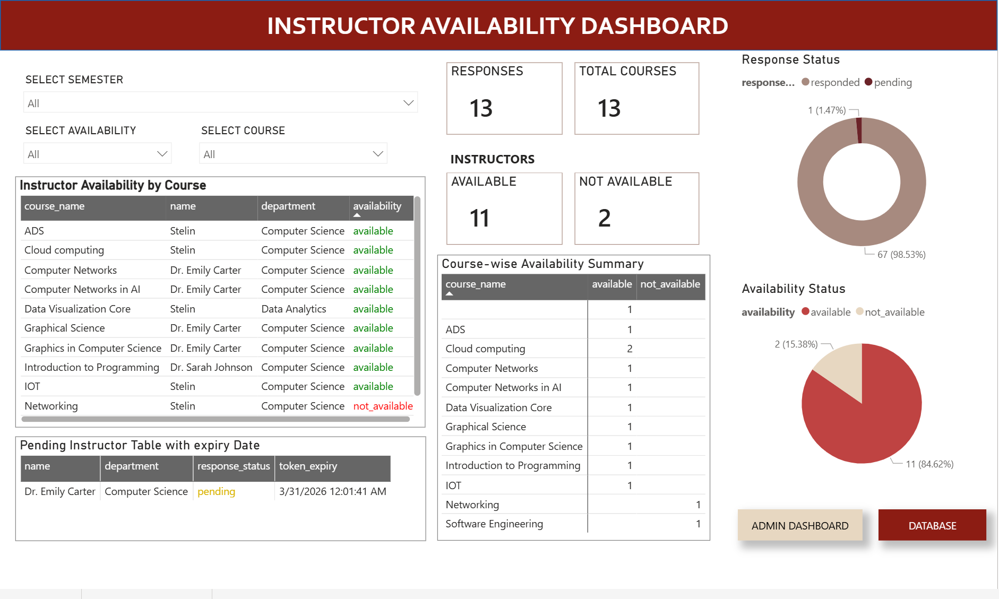

# Instructor Availability System

## Live Demo: https://instructoravailabilitysystem.web.app/
## Project Overview

This project was developed as part of my **Master’s Software Development project**, with the goal of solving a very real problem in academic scheduling — collecting instructor availability efficiently.

Traditionally, this process is handled through manual emails, spreadsheets, and follow-ups, which is time-consuming, error-prone, and difficult to track. I wanted to build a system that automates this entire workflow and provides real-time visibility into responses.

## What the project does?

The **Instructor Availability System** is a web-based application that allows administrators to send availability requests to instructors and track responses in a structured and automated way.

Instead of back-and-forth emails, instructors can respond using simple buttons (Available / Not Available), and their responses are instantly recorded and reflected in a dashboard. 

## Key idea

The main idea behind this project was to:

* Replace manual email communication with **automated campaigns**
* Allow instructors to respond quickly without friction
* Provide admins with **real-time insights** for decision-making
* Build a system that is **scalable and easy to manage**

Note: The live dashboard and database are restricted due to access policies. Screenshots/Video are provided for demonstration.

## How it works (high-level)

The system has three main parts:

### 1. Admin Panel

* Admin can add courses (assigned or unassigned instructors)
* Start different types of campaigns:

  * Assigned campaigns
  * Broadcast campaigns (for unknown instructors)
* Send reminder emails
* Monitor system through dashboard

### 2. Instructor Interface

* Instructors receive an email with response options
* They can:

  * Click **Available / Not Available**
  * Open a full form if needed
* Multiple responses are allowed, but only the **latest response is considered**

### 3. Dashboard (Power BI)

* Displays real-time insights:



  * Response rate
  * Pending responses
  * Course-wise availability
  * Instructor availability status
* Helps in quick scheduling decisions

## Email System

One of the most interesting parts of this project is the email system:

* Supports structured HTML emails with quick response buttons
* Designed with fallback support for different email clients
* Simulates interactive behavior without requiring full AMP integration
* Sends confirmation after response submission


## Technologies used

* **Frontend:** HTML, CSS, JavaScript
* **Backend:** Node.js (Cloud Functions)
* **Database:** Google Sheets (via API)
* **Email Service:** Gmail API
* **Hosting:** Firebase Hosting
* **Analytics:** Power BI

## Sample Dataset

A sanitized sample dataset is included in the repository to demonstrate the structure of the system's database.

📂 File: `assets/sample-database.csv`

This dataset represents how instructor availability data is stored and processed in the system.

> Note: The production database is hosted in Google Sheets and is not publicly accessible due to data privacy and institutional restrictions.

## Why this project matters?

This project demonstrates:

* Real-world problem solving
* Full-stack system design
* API integration (Google services)
* Automation of workflows
* Data-driven decision support

It also highlights how simple tools like Google Sheets can be transformed into a functional backend when combined with cloud services.

## Demo Video

[![Watch Demo]](https://youtu.be/-yFFRDdhZAk)

The demo video shows:

* Admin creating courses and campaigns
* Email being sent to instructors
* Instructor submitting responses
* Dashboard updating in real-time

## Setup Instructions

### 1. Clone the repository

```bash
git clone <your-repo-url>
cd INSTRUCTORAVAILABILITYSYSTEM
```

### 2. Install dependencies

Install dependencies in the root project, admin UI, and cloud functions folders.

```bash
npm install
cd admin-ui
npm install
cd cloud-functions
npm install
cd ../..
```

### 3. Set up Google Cloud

In Google Cloud Console:

* Enable the Gmail API
* Enable the Google Sheets API
* Create a service account
* Download the JSON key file

Place the JSON key file inside:

```text
admin-ui/cloud-functions/
```

### 4. Configure environment variables

Create a `.env` file inside `admin-ui/cloud-functions/` and add:

```env
GOOGLE_APPLICATION_CREDENTIALS=./your-service-account.json
```

Replace `your-service-account.json` with the actual filename of your downloaded key.

If your project also uses deployed URLs and Gmail credentials, include them as needed:

```env
FORM_BASE_URL=...
API_BASE_URL=...
SENDER_EMAIL=...
GMAIL_CLIENT_ID=...
GMAIL_CLIENT_SECRET=...
GMAIL_REFRESH_TOKEN=...
```

### 5. Run Firebase

Log in to Firebase and start the emulator:

```bash
firebase login
firebase emulators:start
```

### 6. Run the application

Open the following files in the browser:

```text
admin-ui/index.html
instructor-ui/index.html
```

## Notes

* Make sure the required Google APIs are enabled before running the project.
* If running the deployed version, update the frontend API base URL to the live backend URL.


## Security
- Token-based access
- No login required
- Secure mapping of responses


## Known Limitations
- AMP email not fully implemented
- Requires API permissions setup

## Future Improvements
- Full AMP email support
- AI-based scheduling
- Improved UI/UX
- Advanced analytics

## Authors

Overall, this project transformed a manual, repetitive process into an **automated, trackable, and scalable system**. It was a great opportunity to apply both technical and design thinking skills to a practical university use case.

- MANJUMANEY CHOODALI MANEY
- STELIN MACWAN
